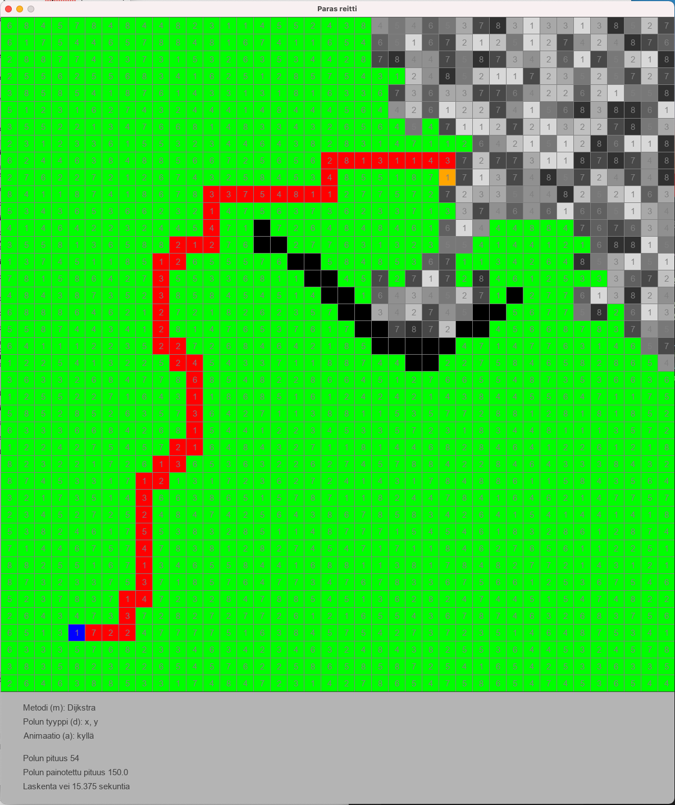

# Tiralabra - 2022 periodi 4 

# Pikselikarttanavigaattori

Kehitettävä sovellus on pikselikarttaa hyväksi käyttävä navigaattori, joka löytää parhaan reitin kahden pisteen välillä.  Kartan jokaisella pikseliruuduilla on tietty arvo (esim. välillä 1-10), joka kertoo  miten paljon aikaa kuluu reitin kulkiessa pikselin kautta.  Pikselin arvo korreloi pikselin tummuusasteen kanssa.  Mitä tummempi ruutu, sitä hitaampi reitin kohta.

Polunetsinnän nopeutta testataan ainakin kahdella eri algoritmilla, joita ovat Dijkstran perinteinen, A*  ja Jump Point Search.

## Dokumentaatio

[Tehtävän määrittely](https://github.com/lautanal/tiralabra/blob/master/dokumentaatio/maarittelydokumentti.md)

[Työaikakirjanpito](https://github.com/lautanal/tiralabra//blob/master/dokumentaatio/tyoaikakirjanpito.md)

## Releaset

tyoaikakirjanpitoz,md