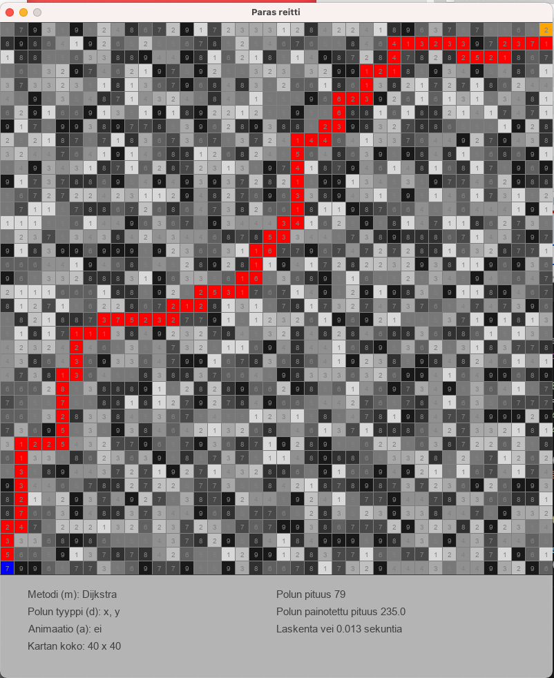

# Tiralabra - 2022 periodi 4 

# Pikselikarttanavigaattori

Kehitettävä sovellus on pikselikarttaa hyväksi käyttävä navigaattori, joka löytää nopeimman reitin kahden pisteen välillä.  Kartan pikselien väri kertoo, onko kyseessä este vai kuljettava polku.  Poluilla on pikselien väreistä tai tummudesta riippuva kulkunopeus.

Polunetsinnän nopeutta testataan ainakin kahdella eri algoritmilla, joita ovat Dijkstran perinteinen ja Jump Point Search.

## Dokumentaatio

[Tehtävän määrittely](https://github.com/lautanal/tiralabra/blob/master/dokumentaatio/maarittelydokumentti.md)

[Työaikakirjanpito](https://github.com/lautanal/tiralabra//blob/master/dokumentaatio/tyoaikakirjanpito.md)

## Releaset

tyoaikakirjanpitoz,md