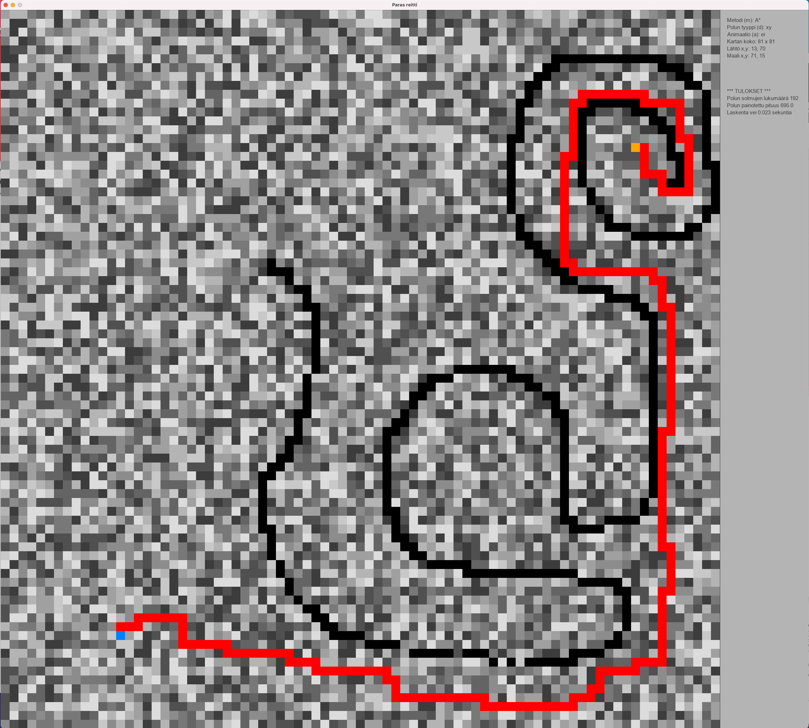

# Käyttöohje

## Ohjelman lataus

Lataa sovelluksen [release](https://github.com/lautanal/tiralabra/releases/tag/Final).

## Ohjelman asentaminen

Ohjelma kopioidaan haluttuun hakemistoon.

Hakemistoon luodaan virtuaaliympäristö seuraavasti:

$ poetry install

## Ohjelman käynnistäminen

Ohjelma käynnistetään asennushakemistossa komennolla:

$ poetry run python3 src/bestroute.py

## Käyttöliittymä

Sovellusta käytetään Pygamella luodun käyttöliittymän avulla :

Käyttäjä valitsee lähtö- ja maaliruudun hiiren vasemmalla näppäimellä.  Kun lähtö ja maali on valittu, hiiren vasemmalla näppäimellä voi asettaa esteet, joiden läpi reitti ei voi kulkea.
Lähdön ja maalin sekä esteet voi poistaa hiiren oikealla näppäimellä.

Haluttu menetelmä reitin hakemiseen valitaan näppäimellä m.

Laskenta käynnistetään näppäimellä s.

## Komennot

### Näppäinkomennot:

s : start, laskee parhaan reitin

c : clear, poistaa lähtö- ja maalipisteet

r : reset, pyyhkii lasketun reitin

m : metodi, Dijkstra / A* / IDA* / JPS

d : diagonal, polun tyyppi, vain x ja y-suunnat / väli-ilmansuunnat sallittu

a : animointi, päälle / pois

n: new, generoi uuden painotetun random-kartan

g: generate, generoi uuden painottamattoman random-kartan (kaikki ruudut saman arvoisia)

t : test, ohjelma käy läpi kymmenen painotettua random-testikarttaa (koko 100 x 100) ja laskee keskimääräisen hakuajan eri menetelmille

\+ : lisää ruutujen lukumäärää 10 prosentilla molemmissa suunnissa ja generoi uuden kartan

\- : vähentää ruutujen lukumäärää 10 prosentilla molemmissa suunnissa ja generoi uuden kartan

1 : lataa kartta 1.map (hakemistosta data/maps)

2 : lataa kartta 2.map (hakemistosta data/maps)

w : write, talleta kartta tiedostoon f.map (hakemistoon data/maps)

f : file, lue karttatiedosto f.map (hakemistosta data/maps)

### Hiiren toiminnot:

Hiiren vasen näppäin valitsee reitin lähtöpisteen (jos sitä ei ole ennestään kartalla)

Hiiren vasen näppäin valitsee reitin maalipisteen (kun lähtöpiste on valittu ja maalipiste puuttuu)

Hiiren vasen näppän asettaa esteen (kun alku- ja maalipiste on asetettu)

Hiiren oikea näppäin pyyhkii ruudun (alkupisteen, maalipisteen tai esteen)

Editoinnissa hiiren vasen näppäin lisää ruudun painoarvoa, oikea vähentää

